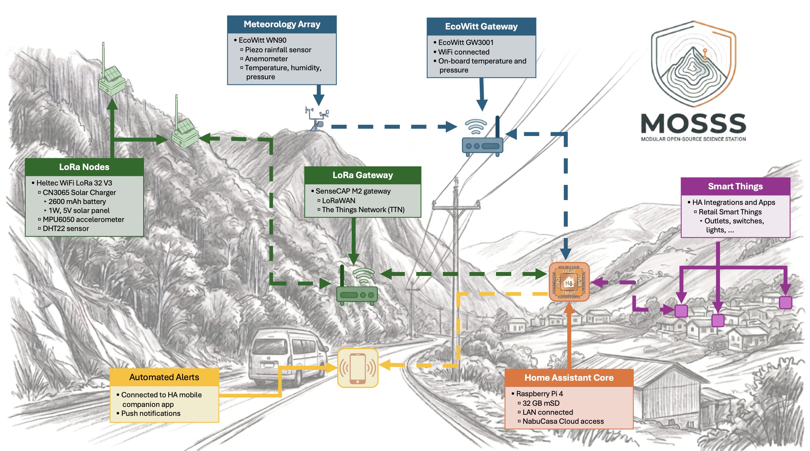

# Modular and Open-Source Science Station (MOSSS)
> **Safe stones gather moss.**

---

The Modular and Open-Source Science Station (MOSSS) features a decentralized environmental monitoring network designed for rugged, remote terrain. Utilizing a localized LoRaWAN mesh alongside EcoWitt meteorological sensors, the system aggregates real-time microclimate data, barometric pressure, and physical movement tracking.

At the core of the MOSSS physical tracking infrastructure is the **Wake on Interrupt Landslide Detector (WOILD)** subsystem—an open-source hardware and telemetry framework specifically engineered to monitor slope stability and ground acceleration.

All data streams converge on a centrally located, local Home Assistant Core gateway, which orchestrates automated mobile alerts via custom vector deviation matrices and bridges the network into broader commercial smart integrations.

---

## 🛠️ Hardware Stack

| Layer | Device | Sensors / Specs |
| :--- | :--- | :--- |
| **Field Nodes** | Heltec WiFi LoRa 32 V3 | MPU6050 Accelerometer, DHT22, 1W Solar |
| **Weather** | EcoWitt WN90 Array | Piezo Rain, Anemometer, Temp/Humid/Pres |
| **Gateways** | SenseCAP M2 & EcoWitt GW3001 | LoRaWAN (TTN), WiFi |
| **Core Gateway**| Raspberry Pi 4 / 5 | 32GB mSD, Home Assistant Core, Nabu Casa |

---

## 🗺️ Quick-Start Navigation Guide

If you are new to the repository, use this directory map to quickly find files for your current build phase:

| What you want to do | Go to Directory | Description & Key Files |
| :--- | :--- | :--- |
| **Build & Wire Hardware** | [`/hardware`](./hardware/) | Schematics (`v3_circuit.png`), PCB Gerbers, and enclosure guidelines. |
| **Flash Firmware & Add Payload Decoder** | [`/software`](./software/) | Arduino sketch for **WOILD v1.1.6** nodes, TTN JS decoder, and ESPHome YAMLs. |
| **Configure Home Assistant & Alerts** | [`/software/Home-Assistant`](./software/Home-Assistant/) | HAOS deployment, `databroker` M2M user, template sensors, and recorder settings. |
| **Read Notebooks & Field Research** | [`/docs`](./docs/) | Science Station Notebook, field logs, and research documentation. |
| **View Diagrams & Photos** | [`/images`](./images/) | Wiring diagrams, circuit photos, and dashboard UI captures. |

---

## 🚀 Step-by-Step Deployment Roadmap

After [purchasing all necessary hardware,](/hardware/) to take a MOSSS station from raw parts to an active field deployment, execute these sequential steps:

1. **Set-up Home Assistant Server (Provision Central Gateway):** Follow [`/software/Home-Assistant/`](./software/Home-Assistant/) to install HAOS, create the `databroker` M2M user account, and configure 30-day recorder filters before bringing field nodes online.
2. **Integrate Commercial Smart Equipment:** Unbox, power up, and integrate off-the-shelf meteorological hardware—such as the **EcoWitt GW3001** weather station gateway—directly into Home Assistant to establish real-time microclimate baselines (rainfall, wind vectors, and barometric pressure).
3. **Add WiFi sensors with ESPHome (Optional):** Set up option-based Wi-Fi or Tailscale VPN nodes using [`/software/ESPHome/`](./software/ESPHome/).
4. **Hardware Assembly & Sensor Construction:** Refer to [`/hardware/`](./hardware/) and `images/v3_circuit.png` to build physical enclosures, wire your Heltec V3 board, and connect accelerometers and environmental sensors.
5. **Setup TTN and LoRa transmissions:** Navigate to https://nam1.cloud.thethings.network and create an account. If no public gateway is available, setup your TTN LoRa gateway. Create an application and link it to the HA TTN integration using the application id, API Key, and TTN server address.
6. **Flash WOILD v1.1.6 Firmware & Calibrate:** Navigate to [`/software/Landslide-Detectors/`](./software/Landslide-Detectors/), configure your LoRaWAN credentials (`DevEUI`, `AppEUI`, `AppKey`), assign unique node IDs (`NODE_ID`), set static baseline orientation angles, and flash the MCU via Arduino IDE or PlatformIO. Then, open `WOILD_v1.1.6_payload_formatter.js` in [`/software/Landslide-Detectors/`](./software/Landslide-Detectors/) and paste the decoder script into your TTN or ChirpStack uplink payload formatter console.
7. **Field Installation & Alert Verification:** Mount hardware nodes at your field station, run physical tilt/motion interrupt tests, and verify real-time data ingestion and vector deviation matrix alerting on your Home Assistant dashboard.

---

## 🔄 How It Works (Data Pipeline)

1. **Telemetry Collection:** Solar-powered WOILD LoRa nodes monitor environmental metrics and structural movement on hillsides, remaining in deep sleep until periodic transmission or hardware motion interrupts trigger an uplink.
2. **Backhaul:** Data is pushed via LoRaWAN to the SenseCAP gateway (integrated with TTN), while weather data routes through the EcoWitt gateway. Remote ESP32 Wi-Fi nodes utilize encrypted Tailscale WireGuard tunnels.
3. **Processing & Action:** Home Assistant Core ingests all streams, evaluates slope movement against real-time rainfall data via custom matrix template equations, handles local valley logic, and pushes automated alerts to mobile clients.

---

## ⚖️ Credits and Disclaimers

### Project Credits
* **System Design & Architecture:** Developed by Brandon J. Winters, Ph.D.
* **Firmware & Core Logic:** Built on the WOILD v1.1.6 framework.

### AI Transparency & Media Disclosure
* **Documentation & Asset Assistance:** Portions of the configuration optimization, code documentation, and README organization were refined with the assistance of large language models (Gemini/ChatGPT).
* **Visual Imagery:** Conceptual diagrams, branding icons, or repository header graphics were generated using AI imaging tools with human-directed engineering prompts. These assets are intended purely for illustrative, conceptual, and repository-visual enhancement purposes.

### Academic Citation Note
If you are utilizing the WOILD framework, hardware PCB configurations, or the Home Assistant automation matrix in academic research, please cite the primary manuscript: