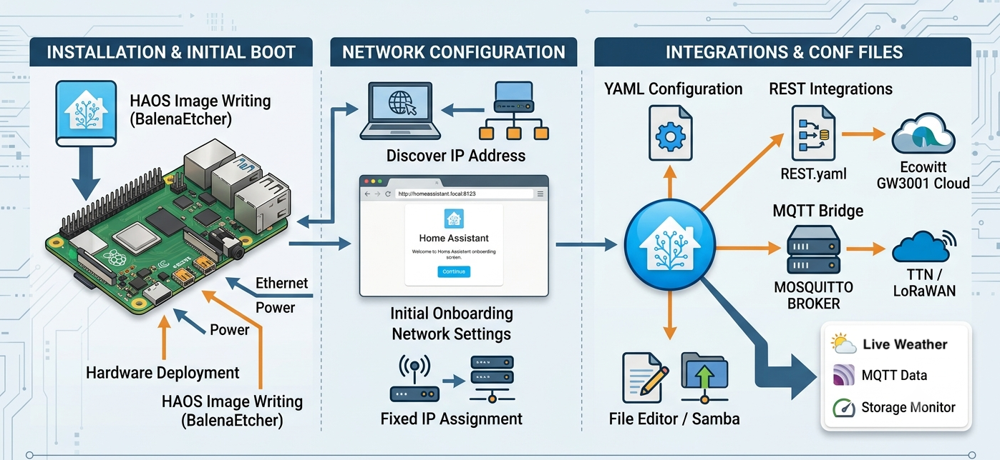

# 🏠 Chapter 2: Home Assistant Setup

## [Configure the Home Assistant Gateway](../software/Home-Assistant/)
This chapter covers the initial physical provisioning and bare-metal OS installation for the central **Modular and Open-Source Science Station (MOSSS)** edge gateway. As such, it walks through:
1. Installation of **Home Assistant OS (HAOS)** on a Raspberry Pi 4 or 5.
2. Establishing two-tiered login access.
3. Create a dedicated Machine-to-Machine (M2M) profile called `databroker` (login: `databroker`) under **Settings > People** to handle incoming data streams securely.

> ⚠️ **CRITICAL ORDERING:** Adhere strictly to the sequence below. Misordering these setup steps will result in a failed headless boot or network mismatch.

### 🏠 Stage 1: Home Assistant OS Bare-Metal Installation

 **📋 Prerequisites & Hardware Checklist**

Before beginning, ensure your central hub hardware components match our verified specifications:

*   **Single Board Computer:** Raspberry Pi 4 or Raspberry Pi 5 (Minimum 4GB RAM recommended).
*   **Power Supply:** Official Raspberry Pi USB-C power supply (15W for Pi 4, 27W for Pi 5) to prevent undervoltage failures.
*   **Storage:** A 32GB high-endurance microSD card (UHS Speed Class 3 / V30 or better rated for continuous write cycles) or an external USB 3.0 SSD.
*   **Network:** An Ethernet cable connected directly to your local network switch/router for initial provisioning.

---

### 💿 Installation Step-by-Step

Because the gateway needs to compute vector matrices locally without internet dependence, we utilize the bare-metal **Home Assistant Operating System (HAOS)**.

<ul style="list-style: none; padding-left: 0;">

  <!-- STEP 1 -->
  <li style="margin-bottom: 30px; border-bottom: 1px solid #30363d; padding-bottom: 20px;">
    <h3 style="margin-top: 0;">1. Download the Flashing Tool</h3>
    
<em>Requires Mac, Windows, or Linux PC</em>

    Download and install the official <strong>Raspberry Pi Imager</strong> from <a href="https://www.raspberrypi.com/software/">raspberrypi.com/software</a>. Insert your storage media into your flashing computer.
  </li>

  <!-- STEP 2 -->
  <li style="margin-bottom: 30px; border-bottom: 1px solid #30363d; padding-bottom: 20px;">
    <h3 style="margin-top: 0;">2. Select the HAOS Image</h3>
    
<em>Do not use default Pi OS</em>

    <ol>
      <li>Launch the Imager tool. (note: formatting may be required to continue)</li>
      <li>Click <strong>Choose Device</strong> and select your model (e.g., Raspberry Pi 4).</li>
      <li>Click <strong>Choose OS</strong>, scroll down to select <strong>Other specific-purpose OS</strong>, click <strong>Home Automation</strong>, click <strong>Home Assistant</strong>, select <strong>Home Assistant OS</strong>.</li>
    </ol>
  </li>

<!-- STEP 3 (Includes critical warning and image) -->
  <li style="margin-bottom: 30px; border-bottom: 1px solid #30363d; padding-bottom: 20px;">
    <h3 style="margin-top: 0;">3. Flash without OS Customization</h3>
    
<em>Crucial Step</em>

    Select your target storage device and click <strong>Next</strong>.  
    
<!-- Styled Warning Callout Box -->

<strong style="color: #f0b90b;">⚠️ CRITICAL:</strong> If the imager prompts you to apply OS customization settings (like setting up Wi-Fi or SSH), <strong>select NO</strong>. HAOS manages its own network initialization—applying custom configurations through the imager will corrupt the system container structure. Confirm and write the image.

    
<!-- Native HTML Image Element -->

  </li>

  <!-- STEP 4 -->
  <li style="margin-bottom: 30px; border-bottom: 1px solid #30363d; padding-bottom: 20px;">
    <h3 style="margin-top: 0;">4. Headless Initial Boot</h3>
    
<em>Takes 5-15 minutes</em>

    Insert the flashed storage into your Raspberry Pi. Connect an <strong>Ethernet cable</strong> to your router, then plug in the power supply. The Pi will boot headlessly; give it up to 15 minutes to automatically provision, unpack the environment, and fetch system dependencies.
  </li>

  <!-- STEP 5 -->
  <li style="margin-bottom: 30px; border-bottom: 1px solid #30363d; padding-bottom: 20px;">
    <h3 style="margin-top: 0;">5. Complete Onboarding UI</h3>
    
<em>Web Browser Setup</em>

    On a computer connected to the same local network, open a browser window and navigate to:
    <code>http://homeassistant.local:8123</code>
    *(If the hostname fails to resolve, check your router's DHCP client list to find the Pi's IP address and navigate to <code>http://YOUR_PI_IP:8123</code>).* Follow the prompts to create your local admin account.
  </li>

</ul>

---

## 🔐 Stage 2: Operational Security (OpSec) & Network Provisioning
Once you have landed on your fresh home assistant dashboard and created your main owner account, advance to user provisioning and system networking:

This section defines the access permissions, secure data pipelines, and remote connectivity meshes required to protect the MOSSS gateway hub from corruption while allowing open scientific collaboration.

---

### 🛡️ Multi-Tiered User Access Tiers

Configure these explicit profiles under **Settings > People** on your newly installed dashboard:

### 1. Research Partner Profiles (`Admin`)
*   **Access Level:** Administrative configuration rights.
*   **Deployment:** System owner and shared strictly with active field engineers and collaborative research institution partners to tweak template filters or debug physical sensor links.

### 2. Public Observation Profile (`User / Non-Admin`)
*   **Access Level:** Read-Only view rights (Dashboard visualization access only).
*   **Deployment:** Provided to local community leaders, public donors, or visiting scientists. Completely blocks out system configuration menus, preventing accidental damage.

### 3. Machine-to-Machine (M2M) Data Pipeline (`databroker`)
*   **Access Level:** Non-admin, Data Authentication Account (Bypasses human UI interaction entirely).
*   **Deployment Name:** `databroker`
*   **Crucial Setup:** This profile handles incoming data streams from both your local network and remote field assets. Whether your nodes are feeding data locally via the Mosquitto Broker or connecting from remote field sectors using **ESPHome Tailscale** configurations, they use the `databroker` credentials to securely authenticate their data payloads.

> ⚠️ **SECURITY COMPLIANCE WARNING:** Never reuse the credentials for `databroker` on human user profiles. Isolating your automated data pipeline ensures that even if an external field node is physically tampered with, your core gateway administration remains entirely secure.

---

👉 **Proceed to Home Assistant Integrations[Chapter 3](./ch03-home-assistant-integrations.md)**