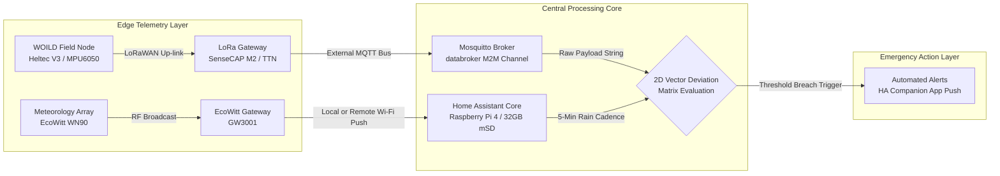

## 🧭 Next Step
Review the full applications setup documentation located inside this folder for specific step-by-step installation instructions for Tailscale, HACS, and cloud sync options:

## 🔌 MOSSS Gateway: Software Integrations & Add-ons Blueprint

This document details the software application layer, community integrations, and network translators deployed within the **Modular and Open-Source Science Station (MOSSS)** central gateway ecosystem. This configuration translates incoming environmental RF data into local vector matrices and safety alerts.


---


## 📦 Installed Add-ons (The Application Layer)
These applications run as isolated system containers managed by the Home Assistant Supervisor to provide local backend utilities:

*   **Mosquitto Broker:** Our high-performance, local MQTT message broker. It ingests data packets directly from our LoRaWAN network layout using the `databroker` M2M credentials and serves them to the automation engine.
*   **File Editor / Studio Code Server:** Provides a direct editor workspace to securely update configuration scripts and manage local asset logs inside the `3-Runtime-Configuration` directory.
*   

---

## 📡 Telemetry & Network Translators (Custom Integrations)

These integrations handle data parsing from your distributed field tracking arrays:

### 1. MQTT & The Things Network (TTN)
*   **Function:** Bridges the long-range LoRaWAN telemetry network with the Home Assistant automation bus.
*   **Data Pipeline:** Physical WOILD landslide edge nodes blast packets via LoRaWAN $\rightarrow$ The Things Network processes the decentralized frames $\rightarrow$ Telemetry data is funneled locally via **MQTT** to update our tracking matrices instantly.

### 2. EcoWitt & Weather.com
*   **Function:** Captures hyper-local meteorological profiles directly from our on-site microclimate array via local network broadcasts, complemented by regional historical projections via the Weather.com API.
*   **Data Pipeline:** Streams real-time rain accumulation rates and storm factors directly into our threshold matrices to correlate rainfall infiltration against immediate ground slope shift events.


---

## 🛠️ Power User Tools & Extended Frameworks

*   **HACS (Home Assistant Community Store) & Get HACS:** Deployed as our secondary package manager to unlock community-driven custom cards, integrations, and advanced backend tools not available in the core distribution line.
    > 🔐 **INSTALLATION PREREQUISITE:** To initialize the HACS environment on a fresh installation, you must have a valid **GitHub Account**. The setup process requires you to authenticate the local gateway using GitHub's secure OAuth device-pairing key protocol before the community repository manager can unlock.

---

## 📊 Dashboard UI & Environmental Visualization (HACS Frontend Layer)
To deliver a high-readability monitoring UI for emergency response teams and field technicians, our primary command dashboard leverages custom frontend assets installed via HACS:

### 1. Layout & Styling Engines
*   **UI eXtension (UIX) & card-mod:** Used to inject custom CSS styling variables across the frontend DOM. This enables advanced element customization required to dynamically alter card behaviors, backgrounds, and warning indicator colors.
*   **visionOS & iOS Liquid Glass Theme:** Deployed as our primary visual theme wrapper, creating an exceptionally clean, modern glassmorphic interface that optimizes visual scanning in low-light command environments.

### 2. Microclimate & Spatial Tracking Cards
*   **Weather Radar Card & Weather.com Integration:** Displays live, interactive radar precipitation scans directly alongside our sensor readouts to map approaching storm cells before they cross our physical monitoring area.
*   **Windy.com (Embedded Webpage Card Framework):** Bypasses the need for complex API keys or heavy code integrations. By dropping a standard Home Assistant **Webpage Card** onto the frontend layout, operators can embed live, interactive wind vector models and barometric tracking directly from Windy.com. This provides instant, resource-light visualization of real-time atmospheric patterns and incoming storm cells without putting extra processing strain on the Raspberry Pi's CPU.
*   **Clock Weather Card & Horizon Card:** Renders critical astronomical, dawn/dusk, and sun elevation metrics—essential data points when analyzing real-time solar harvesting performance on our battery-powered field arrays.
*   **Map Card:** Dynamically displays the precise geospatial coordinate markers ($X, Y$) of individual active WOILD nodes distributed across the hillsides, turning color-coded red if a vector deviation trigger trips.

---

## 🔔 Emergency Alerting & Safety Channels

*   **Mobile App Integration:** Links localized system notifications directly to the **Home Assistant Companion App** on field-technician smartphones. This setup bypasses standard cloud delivery delays to fire **high-priority critical alerts** with custom alert sounds immediately upon matrix breach.
*   **Google Translate Text-to-Speech (TTS):** Configured to broadcast voice alerts through local audio hardware connected to the gateway. If a slope matrix registers structural failure risks, the hub issues audible verbal emergency warnings locally alongside mobile push alerts.

---

## 🏛️ System Housekeeping Integrations (Native)
These integrations are natively provisioned by **Home Assistant OS (HAOS)** and handle foundational server parameters:
*   **Home Assistant Supervisor & Backup:** Manages local container health and automates daily system backups to safeguard historical sensor data.
*   **Raspberry Pi Hardware & Power Supply Checker:** Monitors system metrics, device thermals, and alerts if undervoltage issues threaten edge calculation stability.
*   **Local IP Address, Bluetooth, Meteorologisk institutt, Radio Browser, Shopping List, & Sun:** Tracks gateway network parameters, local weather projections, solar elevation vectors, and auxiliary system entities.

## ⚙️ Stage 3: Runtime Database Optimization & Configuration Guide

This directory houses the live production codebase running the MOSSS gateway. This includes your storage optimization matrices, mathematical template states, and active landslide threshold alert scripts.

---

## 💾 Database Optimization & MicroSD Storage Preservation

The gateway utilizes a **32GB high-endurance microSD card** to host the operating system and local database records. Because the `databroker` continuously ingests rapid telemetry updates, a default configuration will rapidly exhaust disk space or wear out the storage media through excessive write cycles.

### ⏱️ Data Ingestion Cadence & Write Mitigation

To drastically reduce write amplification on the 32GB storage media, the sensor array is tuned to discrete, physics-based reporting intervals rather than continuous streaming:

| Sensor Array | Firmware/Protocol | Normal Transmission Cadence | Engineering Justification |
| :--- | :--- | :--- | :--- |
| **EcoWitt Array** | Local Net Broadcast | **Every 5 Minutes** | Captures fast-moving meteorological fronts and acute rainfall accumulation without flooding the database. |
| **WOILD Nodes (v1.1.6)** | LoRaWAN / ESPHome | **Every 60 Minutes** | Establishes stable, ultra-low-power geological baselines. Provides early structural warning while keeping daily transaction writes minimal. |

Because transactions are structured on 5-minute and 60-minute boundaries rather than sub-second intervals, the local SQLite database engine (`home-assistant_v2.db`) easily remains compact and lightweight over your 30-day retention envelope. Ensure the `recorder:` filter block provided in `configuration.yaml` is applied to lock in this protection layer.

### 📡 End-to-End System Data Flow



---

## 🛠️ Step-by-Step Implementation

### Step 1: Access the Home Assistant Root Configuration Folder
To deploy or modify these files, access the root directory where your primary `configuration.yaml` file is hosted on your Raspberry Pi. This can be accomplished via:
* **The File Editor Add-on** via the Home Assistant sidebar (Highly Recommended)
* **The Studio Code Server Add-on** 
* **Samba share Add-on** utilizing a local network folder mapping

### Step 2: Apply Configuration Files

#### [A] configuration.yaml
1. Open your active local `configuration.yaml` file.
2. Append or merge your current settings with the updated layout provided in our production file.
3. Ensure that your core directory inclusion split lines look exactly like this, though there may be more such as rest, input-numbers, compensations, script, and secrets :
    ```yaml
    automation: !include automations.yaml
    template: !include templates.yaml
    ```

#### [B] templates.yaml
1. Open `templates.yaml` (create it in the root folder if it does not exist).
2. Overwrite the contents entirely with the sanitized `LD01` telemetry matrix code block provided.
3. Duplicate the needed code blocks for every sensor you intend to install (See Grid Expansion below).

#### [C] automations.yaml
1. Open `automations.yaml`.
2. Append or replace your active blocks with the updated `LD01` and `Heavy Rain` rules.
3. Duplicate the needed code blocks for every sensor you intend to install (See Grid Expansion below).
4. ⚠️ **CRITICAL VISUAL EDITOR WARNING:** Both automations utilize `mode: queued` and custom templates. Modifying these rules inside the Home Assistant Visual UI Editor may strip out or break the raw YAML syntax. **Always edit alerts directly in code.**

### Step 3: System Validation & Reloading
Before applying any configuration changes or restarting Home Assistant, you **MUST** validate the structural integrity of your YAML files:

1. In Home Assistant, navigate to: **Developer Tools > YAML**.
2. Click the **Check Configuration** button.
3. If any errors are flagged, double-check your spacing, indentation, and ensure no raw `<` or `>` characters are unquoted.
4. Once configuration validation passes successfully, scroll down to "YAML Configuration Reloading" on the same page and click: **"Reload All YAML Configuration"**.

---

## 🚀 Grid Expansion (Adding Hardware Nodes LD02 Through LD10)

When deployment of additional monitoring hardware is required in the field:

1. Open the target configuration file (`configuration.yaml`, `templates.yaml`, or `automations.yaml`).
2. Review the structural *Automation Scaling Note* commented at the top of the file.
3. Duplicate the relevant `LD01` code block.
4. Perform a localized **Find & Replace** inside **ONLY** your newly duplicated block:
   * Change all instances of `LD01` to your new index (e.g., `LD02`)
   * Change all instances of `ld01` to your new index (e.g., `ld02`)
   * Change all instances of `landslide_01` to your new index (e.g., `landslide_02`)
5. **Update Spatial Attributes:** Update the `baseline_x`/`baseline_y` coordinates in the Safety Matrix block and the physical `latitude`/`longitude` attributes in the Live Trackers block to match the specific, calibrated survey location of the new field hardware.
6. Re-run **Step 3 (Validation & Reloading)** to bring your new node online instantly.

---

### [Map Inputs to Your Meteorological Sensors](../software/EcoWitt/)
1. Ensure your local **EcoWitt** weather gateway is integrated with Home Assistant, calibrated to transmit wind, rain, and pressure data updates at a steady **5-minute ingestion cadence**.
    > 💡 *Note: For deployments were your Home Assistant server and GW3000 gateway are not on the same network, an access token can be used to provide remote data streaming and intermitant HA pulldown requests.*
2. Optional: Embed interactive vector models on your dashboard using a standard Webpage Card pointing to a customized Windy.com viewport string.

## 🌦️ EcoWitt GW3001 Integration Guide

This guide details two methods for integrating the **EcoWitt GW3001** gateway into Home Assistant: a low-latency, local network connection using Home Assistant's native integration, and a cloud-based RESTful API approach designed for remote off-grid deployments.

---

> [!CAUTION]
> **Operational Security (OpSec):** Never hardcode live API keys, application secrets, or MAC addresses directly in version-controlled `.yaml` files. Always store sensitive values in `secrets.yaml`.

---

## 🏠 Method 1: Local Network Integration (Native Webhook)

Use this method when the EcoWitt GW3001 gateway and your Home Assistant server reside on the same local network subnet.

### Step 1: Configure Custom Webhook in WS View Plus
1. Open the **WS View Plus** (or EcoWitt) mobile app on a device connected to the local Wi-Fi network.
2. Select your **GW3001** gateway device from the list.
3. Navigate to **Menu** $\rightarrow$ **Customized** (or **Weather Services** $\rightarrow$ **Customized**).
4. Enable the custom upload service and enter the following settings:
   * **Protocol Type:** `Ecowitt`
   * **Server IP / Hostname:** `<YOUR_HOME_ASSISTANT_LOCAL_IP>` (e.g., `192.168.1.100`)
   * **Path:** `/api/webhook/ecowitt`
   * **Port:** `8123` (or your local custom HA port)
   * **Upload Interval:** `300` seconds
5. Save and apply the configuration.

### Step 2: Enable Integration in Home Assistant
1. In Home Assistant, go to **Settings** $\rightarrow$ **Devices & Services**.
2. Click **Add Integration** in the bottom right corner.
3. Search for **Ecowitt** and select it.
4. Confirm the prompt to complete setup. Home Assistant will begin auto-discovering sensor channels as the GW3001 sends webhook payloads.

---

## ☁️ Method 2: Remote Deployment (RESTful Cloud API)

Use this method when the GW3001 is deployed at a remote, off-grid, or field station lacking a direct local network link back to Home Assistant.

## 🔑 Obtaining EcoWitt API Credentials & Hardware Identifiers

This guide outlines how to generate your **Application Key** and **API Key** from the EcoWitt Cloud portal, as well as how to locate your GW3001 hardware **MAC Address** for REST integration.

---

## 1. Generate Application Key & API Key

Both keys are generated inside your user account settings on the official EcoWitt platform:

1. Log into your account at **[ecowitt.net](https://www.ecowitt.net)**.
2. Click your profile icon/avatar in the top-right corner and select **User Center** (or **Profile**).
3. Navigate to the **API Management** tab in the sidebar menu.
4. **Application Key:** Click **Create Application Key** to generate a client identifier string.
5. **API Key:** Click **Create API Key** to generate your personal data authorization token.
6. Copy both generated strings and paste them securely into your deployment records or `secrets.yaml`.

---

## 2. Locate Your GW3001 MAC Address

The MAC address acts as the unique device ID for API query parameters. You can retrieve it using either method below:

### Method A: Via the WS View Plus App
1. Connect your phone to the same local Wi-Fi network as your GW3001.
2. Open the **WS View Plus** app and select **Device List**.
3. Locate your GW3001 gateway. The 12-character MAC address (e.g., `X1:X2:X3:X4:X5:X6`) will be displayed next to the device name.

### Method B: Via the EcoWitt Web Portal
1. Log into **[ecowitt.net](https://www.ecowitt.net)**.
2. Select your weather station dashboard.
3. Open **Device Settings** (gear icon) to view the gateway details, including the registered MAC address.

## 3. Add rest.yaml to Home Assistant
1. Download the rest.yaml file.
2. In Home Assistant, navigate to File Editor and create a new file in the same directory as your configuration.yaml file, named "rest.yaml"
3. Copy the full contents of the downloaded rest.yaml file into your newly created rest file in Home Assistant. Save the file.
4. Verify the yaml by navigating to Seetings->Developer Tools->YAML, Click "Check Configuration" and verify that it will not prevent HA from starting. If successful, click Restart and then select Quick Reload from the available options.
    > 💡 *Note: your configuration yaml must inlude the line "rest !include rest.ymal" or HA will not deploy these changes even after reloading.*