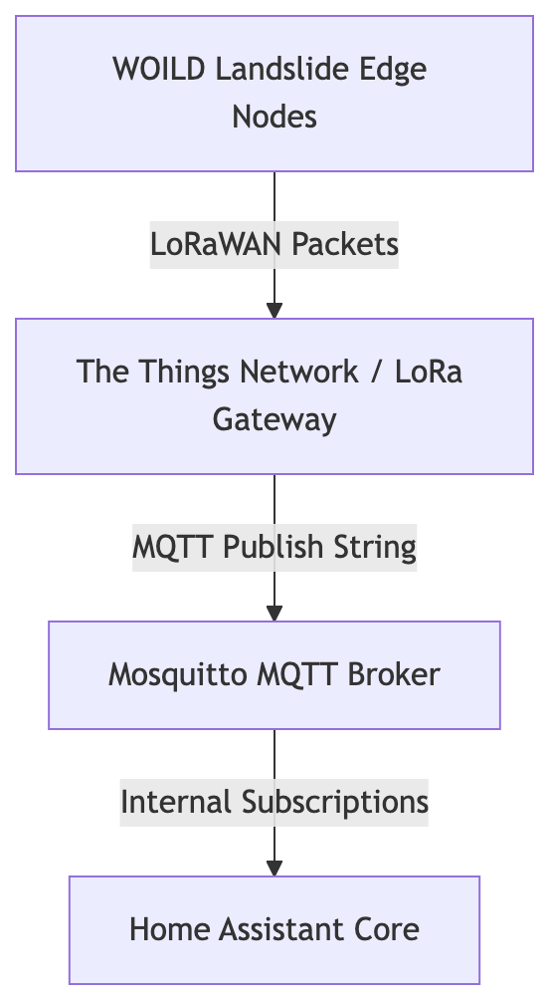

# 🦟 Chapter 4.1: MQTT Integration & Payload Processing

MQTT (Message Queuing Telemetry Transport) is a lightweight, publish-subscribe messaging protocol designed specifically for low-bandwidth, high-latency, or unreliable networks. It serves as the primary machine-to-machine (M2M) communication layer within the MOSSS infrastructure, bridging long-range LoRaWAN telemetry networks directly with the Home Assistant automation engine.

---

## 📡 Architecture & Telemetry Pipeline

Rather than maintaining direct HTTP connections from distributed hardware, our system relies on a local Mosquitto MQTT broker to route telemetry asynchronously:



* **LoRaWAN & The Things Network (TTN) Bridging:** Physical WOILD landslide edge nodes transmit telemetry packets via LoRaWAN to a local gateway/TTN. TTN then funnels these JSON payloads directly to our local Mosquitto broker using dedicated `databroker` M2M credentials to update tracking matrices instantly.
* **Microcontroller Telemetry:** Standalone ESP32/ESP8266 boards or specialized field sensor kits publish readings directly to specific MQTT topics without requiring complex REST API handshakes.
* **Decoupled Architecture:** Home Assistant subscribes to topics (e.g., `mosss/field/node01/telemetry`) to update internal sensor entities in real time without polling delays.

---

## ⚙️ Step-by-Step Mosquitto Broker Setup

Setting up MQTT involves running the local broker container and linking it to Home Assistant.

### Step 1: Install Mosquitto Broker Add-on
1. In Home Assistant, navigate to **Settings → Add-ons → Add-on Store**.
2. Search for **Mosquitto broker**.
3. Click **Install**.
4. In the **Info** tab, toggle **Start on boot** and **Watchdog** ON.
5. Click **START** to initialize the container.

### Step 2: Create an MQTT System User
For security, MQTT clients must authenticate before publishing data to the broker:
1. Go to **Settings → People → Users**. *(Note: If "Users" is hidden, enable **Advanced Mode** under your User Profile).*
2. Click **Add User** in the bottom right.
3. Enter a username (e.g., `mqtt-user` or `databroker`) and a secure password.
4. Click **Create**.

### Step 3: Configure the Native Integration
1. Go to **Settings → Devices & Services**.
2. Click **Add Integration** and search for **MQTT**.
3. Confirm the configuration—Home Assistant will automatically detect the local Mosquitto add-on and prompt you to enable it using the credentials created above.

---

## 🛠️ Defining MQTT Sensors in YAML

Once the broker is operational, define incoming telemetry endpoints in `configuration.yaml` or an included `mqtt.yaml` file:

~~~yaml
mqtt:
  sensor:
    - name: "Field Node 01 Battery Voltage"
      state_topic: "mosss/field/node01/telemetry"
      value_template: "{{ value_json.battery_v }}"
      unit_of_measurement: "V"
      device_class: "voltage"

    - name: "Field Node 01 Tilt X-Axis"
      state_topic: "mosss/field/node01/telemetry"
      value_template: "{{ value_json.tilt_x }}"
      unit_of_measurement: "°"
~~~
### 🖥️ GUI Alternatives to YAML Configuration

If you prefer not to edit `configuration.yaml` directly, Home Assistant offers two graphical UI options to set up MQTT sensors.

---

#### Method 1: The Native MQTT 'Add Device' UI Subentry

Home Assistant allows you to add custom MQTT entities directly from the MQTT integration page without touching configuration files.

1. Go to **Settings → Devices & Services**.
2. Click on the **MQTT** integration card.
3. Click **Add Entry** (or **Add MQTT Device** depending on your Home Assistant version).
4. Fill out the device fields:
   * **Device Name:** e.g., `Field Node 01`
   * **State Topic:** `mosss/field/node01/telemetry`
   * **Value Template:** `{{ value_json.battery_v }}`
   * **Unit of Measurement:** `V`
   * **Device Class:** `voltage`
5. Click **Submit**. Home Assistant will generate the entity automatically.

---

#### Method 2: MQTT Auto-Discovery (Zero-Configuration GUI)

Instead of manually defining sensors in Home Assistant, your field devices or script can publish a single JSON "discovery payload" to the broker when booting up. Home Assistant automatically picks this up and generates the GUI entities with zero user interaction.

**How it works:**
The device publishes a JSON configuration string to the prefix `homeassistant/sensor/[device_id]/config`.

**Example Discovery Payload:**
* **Topic:** `homeassistant/sensor/field_node_01_batt/config`
* **Payload:**
  ```json
  {
    "name": "Field Node 01 Battery Voltage",
    "state_topic": "mosss/field/node01/telemetry",
    "value_template": "{{ value_json.battery_v }}",
    "unit_of_measurement": "V",
    "device_class": "voltage",
    "unique_id": "field_node_01_battery"
  }
  ```

Once published, the entity `sensor.field_node_01_battery_voltage` instantly appears under **Settings → Devices & Services → MQTT**.

---

### 💡 Comparison: YAML vs. GUI Methods

| Feature | `configuration.yaml` | Native MQTT UI Subentry | MQTT Auto-Discovery |
| :--- | :--- | :--- | :--- |
| **Ease of Setup** | Moderate (Requires file editor) | High (Form-based) | Highest (Fully automated) |
| **Version Control** | Easy (Git/backup friendly) | Stored in internal HA database | Stored in internal HA database |
| **Best For** | Static home networks | Quick manual additions | Scalable multi-node field deployments |
---
## ⚠️ Crucial MQTT Concepts for Beginners

### The "Retain Flag" Trap
* **What it is:** When an MQTT client publishes a payload with the `retain: true` flag, the broker stores that message permanently. Any new subscriber (or Home Assistant upon reboot) immediately receives that old message.
* **The Pitfall:** Setting `retain: true` on rapid sensor telemetry can cause "ghost entities" or outdated data to re-populate long after a sensor has been taken offline.
* **Best Practice:** Only set `retain: true` for state-change configurations or static switch states. Keep `retain: false` (default) for continuous sensor streams like battery voltage or tilt data.
---

👉 **Proceed to [Chapter 4.2: ESPHome](./ch04-esphome.md)**